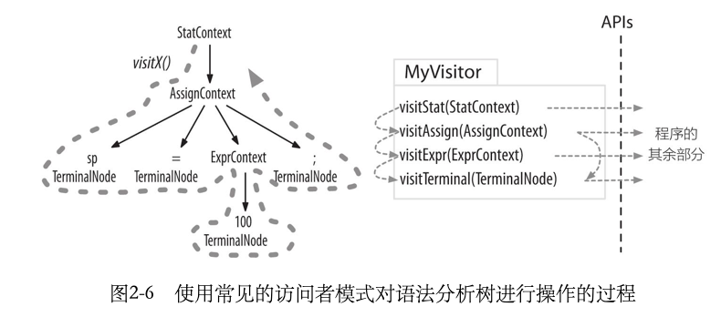

# 第2章 纵观全局

>在本章中，我们将纵观全局，学习语言类应用程序相关的重要过程、术语和数据结构

## 2.1 从 ANTLR 元语言开始

> 语言（language） -> 语句（sentence） -> 词组（phrase） -> 自词组（subphrase）和词汇符号（vocabulary symbol） 

1. 一般来说，如果一个程序可以分析计算或者执行语句，我们就称之为解释器（`interpreter`）
2. 如果一个程序能够将一门语言翻译成另外一门语言，我们就称之为翻译器（`translator`）

> 识别语言的程序称为语法分析器（parser）或者句法分析器（syntax analyzer）
> ANTLR语法本身又遵循了一种专门用来描述其他语言的语法，我们称之为ANTLR元语言（ANTLR’s meta language）

1. lexer 将输入文本转换为词法符号；
2. tokenizer 将单个字符聚合成一个 token；
3. 一个 token 应该包含 token 的类型和它对应的文本；

> **将字符聚集为单词或者符号（词法符号，token）的过程称为词法分析（lexical analysis）或者词法符号化（tokenizing）**
> **我们把可以将输入文本转换为词法符号的程序称为词法分析器（lexer）**

第二个阶段，输入的 token 会被消费并识别成语句，默认会建造 `parse tree` 或者 `syntax tree` 来实现。


> 语法分析树的叶子节点永远是输入的 token

## 2.2 实现一个语法分析器

> 下面的 antlr4 程序就实现了上面语法树的声明。
> 我们声明了一个 grammar assign
> 1. assign 以 token `ID` 作为开始；
> 2. 随后紧跟一个字符 '='；
> 3. 随后又是一个 token `expr`；
> 4. 最后以一个字符 ';' 结尾。
> 这里的本质就是一个 `递归下降的语法分析器（recursive-descent parser）`

```antlrv4
grammar assign;
assign: ID '=' expr ';' ;
```
>下面是antlr4的实现细节

```cpp
void assign() {
    // 将当前的 token 和 ID 对比并消费掉
    match(ID);
    match('=');
    // 通过调用 expr() 来匹配一个表达式
    expr();
    match(';');
}
```

>assign() 方法仅仅验证 **所有的 token 都存在且顺序正确**，assign() 仅仅有一个备选分支，无须做出选择。

```antlrv4
grammar stat;
// 增加了新的备选分支
stat: assign
      | ifstat
      | whilestat
      ;
```

> 这对应的是一个 switch 语句，可以看到，**stat() 方法必须通过检查下一个 token，例如我们首先读取第一个 token，如果他是 `ID` 就进入 `assign()`**
> 这个过程就是语法分析决策（parsing decision）或者预测（prediction）
> 而被检查的这个 token 就称之为 **语法前瞻符号（lookahead token）**，而我们在查看 lookahead token 的时候是不会消费这个符号的。

```c
void stat() {
	switch{
		case ID : 
			assign();
			break;
		case IF:
			ifstat();
			break;
		case WHILE:
			whilestat();
			break;
		default:
			// nothing to do, throw parse exception
	}
}
```

## 2.3 你再也不能往核反应堆多加水了

> 这句话存在歧义：可能是无法再往核反应堆多加水，也可能是不应该往核反应堆多加水。

```antlrv4
grammar stat;
stat: expr ';'
      | ID '();'
      ;
expr: ID '()'
      | INT
      ;
``` 

> 在上面的语法中， `expr ';'` 和 `ID '();` 这两个规则都可以匹配到输入 `f();`。
> antlr4 解决歧义问题的方法是：选择所有匹配的备选分支中的第一条；

## 2.4 使用语法分析树来构建语言类应用工程

> 整个分析的过程是：
> 1. `Lexer` 使用`CharStream`读取文本输出并输出token
> 2. `Parser`使用`TokenStream`读取token并输出`ParseTree`
> `RuleNode` 和 `TerminalNode` 都是 `ParseTree` 的子类，二者分别是子树的根节点和叶节点。


>语法分析树中**子树的根节点类型实际上是 `StatContext`、`AssignContext`、`ExprContext`**，因为这些根节点包含了使用规则识别词组过程中的全部信息，它们被称为上下文（context）对象


## 2.5 语法分析树监听器和访问器

### 语法分析树监听器

>通过listener的机制实现，我们不需要编写对语法树的遍历

1. antlr为每个语法文件生成一个 `ParseTreeListener`，在该类中每个语法的规则都有对应的 enter 和 exit 方法；
2. 当 `ParseTreeWalker` 方法遍历到节点对应的规则时，先通过 `listener.enterEveryRule(ctx);` 进入子节点，再调用 `ctx.enterRule(listener)`。 
3. 当 `ParseTreeWalker` 退出对应的 rule 时，先调用 `ctx.exitRule(listener);`，再调用 `listener.exitEveryRule(ctx);`


#### ParseTreeListener

```java
public interface ParseTreeListener {
	void visitTerminal(TerminalNode node);
	void visitErrorNode(ErrorNode node);
    void enterEveryRule(ParserRuleContext ctx);
    void exitEveryRule(ParserRuleContext ctx);
}
```

### 2.语法树分析器

>在命令行中加入 `-visitor` 可以执行 antlr 生成一个语法访问器接口（visitor interface），语法中的每条规则对应接口中的一个 `visit` 方法。



### 与语法分析相关的术语

- 语言
- 语法：语法定义了语言的语义规则。语法中的每条规则定义了一种词组结构。
- 语法树：代表了语句的结构，其中的每个子树的根节点都使用一个抽象的名字给其包含的元素命名。即子树的根节点对应了语法规则的名字。树的叶子节点是语句中的符号或者词法符号。
- 语法符号：词法符号就是一门语言的基本词汇符号，它们可以代表像是“标识符”这样的一类符号，也可以代表一个单一的运算符，或者代表一个关键字。
- 词法分析器：lexer
- 语法分析器：parser
- 递归下降的语法分析器：recursive-down parser
- 前向预测：lookahead prediction


