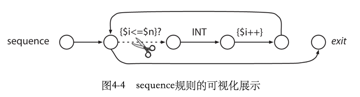

# 第4章 快速指南

## 4.1 匹配算术表达式的语言

> 程序输入

```
193
a = 5
b = 6
a + b * 2
(1 + 2) * 3
```
> antlr4

```antlrv4
grammar Expr;

prog: stat+;

stat: expr NEWLINE
      | ID '=' expr NEWLINE
      | NEWLINE
      ;
// expr 可以是一个
// INT
// 或者一个identifier
// 或者一个乘法表达式
// 或者一个除法表达式
// 或者用括弧括起来的表达式
expr: expr ('*'|'/') expr
      | expr ('+'|'-') expr
      | INT
      | ID
      | '(' expr ')'
      ;

// token
// identifier
ID : [a-zA-Z]+;
INT: [0-9]+;
NEWLINE: '\r'?'\n';
WS: [ \t]+ -> skip;
```

一个grammar由以下元素构成：

1. rule，包含了 `parser rule` 例如 `stat` 和 `expr`，也包含了 `lexer rule` 例如 `ID` 和 `INT`；
2. lexer rule, lexer rule 以大写字母开头；
3. parser rule，parser rule 以小写字母开头；
4. alternative 备选规则，使用 `|` 分割
5. 常量字符，使用 `''` 括起来的

> antlr4 可以处理左递归，例如 `expr: expr ('*'|'/') expr` 就是一种左递归规则。


- prog -> program
- stat -> statement
- expr -> expression

### 1. 语法导入

> 我们可以将 lexer 还有 parser 分开声明

#### lexer

```antlrv4
lexer grammar CommonLexerRules;

ID      : [a-zA-Z]+;
INT     : [0-9]+;
NEWLINE : '\r'?'\n';
WS      : [ \t]+ -> skip;
```

#### parser

```antlrv4
grammar LibExpr;

import CommonLexerRules;

prog: stat+;

stat: expr NEWLINE
      | ID '=' expr NEWLINE
      | NEWLINE
      ;
expr: expr ('*'|'/') expr
      | expr ('+'|'-') expr
      | INT
      | ID
      | '(' expr ')'
      ;
```

#### 编译

```bash
# 将会自动获取import
antlr4 LibExpr.g4
javac LibExpr*.java
# 执行
grun LibExpr prog -tree
```

### 2. 处理有错误的输入

>antlr4 可以自动的报告语法错误并从错误中恢复。

## 4.2 利用visitor构建一个计算器

> 首先我们需要修改一下代码，**我们需要给备选分支加上标签**
> 如果备选分支没有标签，antlr 就为每条 rule 生成一个方法，有标签之后 antlr 会为每个alternative增加一个访问器。
> **标签以 `#` 开头放在 alternative 的右侧。**

### 定义 antlr4 rule with label

```antlrv4
grammar LabeledExpr;

import CommonLexerRules;

prog : stat+;

stat : expr NEWLINE                 # printExpr
      | ID '=' expr NEWLINE         # assign
      | NEWLINE                     # blank
      | CLEAR NEWLINE               # clear
      ;

// op=('*' | '/') 会使得antlr生成的visitor中可以访问该常量字符
expr : expr op=('*'|'/') expr       # MulDiv
     | expr op=('+'|'-') expr       # AddSub
     | INT                          # int
     | ID                           # id
     | '(' expr ')'                 # parens
     ;

// 这些token的声明使得antlr中的parser可以使用 parser.MUL 来访问
MUL : '*';
DIV : '/';
ADD : '+';
SUB : '-';
CLEAR : 'clear';
```

### 实现 visitor

```java
/**
 * @author 0x822a5b87
 *
 * {@link LabeledExprBaseVisitor} 是泛型的，考虑到我们所有的计算都是int，直接继承Integer类型即可
 */
public class EvalVisitor extends LabeledExprBaseVisitor<Integer> {

    private Map<String, Integer> memory = new HashMap<>();

    /**
     * ID '=' expr NEWLINE
     */
    @Override
    public Integer visitAssign(AssignContext ctx) {
        String id = ctx.ID().getText();
        int value = visit(ctx.expr());
        memory.put(id, value);
        return value;
    }

    /**
     * expr NEWLINE
     */
    @Override
    public Integer visitPrintExpr(PrintExprContext ctx) {
        Integer value = visit(ctx.expr());
        System.out.println(value);
        return value;
    }

    /**
     * INT
     */
    @Override
    public Integer visitInt(IntContext ctx) {
        return Integer.valueOf(ctx.INT().getText());
    }

    /**
     * ID
     */
    @Override
    public Integer visitId(IdContext ctx) {
        String id = ctx.ID().getText();
        return memory.getOrDefault(id, 0);
    }

    @Override
    public Integer visitMulDiv(MulDivContext ctx) {
        // 这里有一个容易出错的地方是，我们容易 left = ctx.expr(0)
        // 实际上，因为left和right都是expr，所以需要使用 visit 方法
        int left = visit(ctx.expr(0));
        int right = visit(ctx.expr(1));
        if (ctx.op.getType() == LabeledExprParser.MUL) {
            return left * right;
        } else {
            return left / right;
        }
    }

    @Override
    public Integer visitAddSub(AddSubContext ctx) {
        int left = visit(ctx.expr(0));
        int right = visit(ctx.expr(1));
        if (ctx.op.getType() == LabeledExprParser.ADD) {
            return left + right;
        } else {
            return left - right;
        }
    }

    @Override
    public Integer visitParens(ParensContext ctx) {
        return visit(ctx.expr());
    }

    @Override
    public Integer visitClear(ClearContext ctx) {
        System.out.println("before clear : " + memory);
        memory = new HashMap<>();
        System.out.println("after clear : " + memory);
        return 0;
    }
}
```

### 进入主函数

```java
public class Calc {
    public static void main(String[] args) throws Exception {
        String inputFile = null;
        if ( args.length>0 ) {
            inputFile = args[0];
        }
        InputStream is = System.in;
        if ( inputFile!=null ) {
            is = new FileInputStream(inputFile);
        }
        ANTLRInputStream input = new ANTLRInputStream(is);
        LabeledExprLexer lexer = new LabeledExprLexer(input);
        CommonTokenStream tokens = new CommonTokenStream(lexer);
        LabeledExprParser parser = new LabeledExprParser(tokens);
        ParseTree tree = parser.prog();

        EvalVisitor eval = new EvalVisitor();
        eval.visit(tree);
    }
}
```

### 编译并执行

```bash
# 指定使用visitor访问
antlr4 -no-listener -visitor -package com.xxx.ch04 LabeledExpr.g4
# 编译代码
javac -classpath /usr/local/lib/antlr-4.6-complete.jar Calc.java LabeledExpr*.java EvalVisitor.java
```

## 4.3 利用监听器构建一个翻译程序

>本节就是利用 `Java.g4` 来实现将一个 java 类声明转换为一个 interface 接口声明。

### Demo.java

```java
import java.util.List;
import java.util.Map;
public class Demo {
    void f(int x, String y) { }
    int[ ] g(/*no args*/) { return null; }
    List<Map<String, Integer>>[] h() { return null; }
}
```

### Java.g4

```antlrv4
grammar Java;

classDeclaration
    :   'class' Identifier typeParameters? ('extends' type)?
        ('implements' typeList)?
        classBody
    ;
 
methodDeclaration
    :   type Identifier formalParameters ('[' ']')* methodDeclarationRest
    |   'void' Identifier formalParameters methodDeclarationRest
    ;
```

### listener

```java
/**
 * @author 0x822a5b87
 *
 * 抽取java的类定义、方法定义并转换为接口
 */
public class ExtractInterfaceListener extends JavaBaseListener {

    private final JavaParser parser;

    public ExtractInterfaceListener(JavaParser parser) {
        this.parser = parser;
    }

    @Override
    public void enterImportDeclaration(ImportDeclarationContext ctx) {
        System.out.println(parser.getTokenStream().getText(ctx));
    }

    @Override
    public void enterClassDeclaration(ClassDeclarationContext ctx) {
        // ctx.getText() 返回整个上下文中所有的节点的文本
        // ctx.Identifier() 返回 identifier
        System.out.println("interface I" + ctx.Identifier() + " {");
    }

    @Override
    public void exitClassDeclaration(ClassDeclarationContext ctx) {
        System.out.println("}");
    }

    @Override
    public void enterMethodDeclaration(MethodDeclarationContext ctx) {
        TokenStream tokens = parser.getTokenStream();
        String type = "void";
        if (ctx.type() != null) {
            type = ctx.type().getText();
        }
        String args = tokens.getText(ctx.formalParameters());
        System.out.println("\t" + type + " " + ctx.Identifier() + " " + args);
    }

}
```

### main

```java
public class ExtractInterfaceTool {
    public static void main(String[] args) throws IOException {
        FileInputStream is = new FileInputStream(args[0]);
        // 输入
        CharStream input = new ANTLRInputStream(is);
        // lexer
        JavaLexer lexer = new JavaLexer(input);
        // 使用lexer将输入转换为tokens
        CommonTokenStream tokens = new CommonTokenStream(lexer);
        // 使用parser解析tokens内容
        JavaParser parser = new JavaParser(tokens);
        // 开始语法分析并生成ast
        CompilationUnitContext ctx = parser.compilationUnit();

        // 遍历ast
        ParseTreeWalker walker = new ParseTreeWalker();
        ExtractInterfaceListener listener = new ExtractInterfaceListener(parser);
        walker.walk(listener, ctx);
    }
}
```

## 4.4 定制语法分析过程

### 1. 在语法中嵌入任意动作

#### antlr

>通过action我们可以实现某些语义判定
>1. 我们通过 `members` 将代码注入到parser
>2. 通过 `{}` 可以自定操作

```antlrv4
grammar Rows;

// members action 可以将代码诸如到生成的parser使之成为类的成员。
// RowsParser 自定义的构造器
@parser::members {
  int col;
  public RowsParser(TokenStream input, int col) {
    this(input);
    this.col = col;
  }
}

file: (row NL)+ ;

// locals 子句定义了局部变量 i
// action 就是 {} 包围的一些代码片段
// row 访问了 $i
// row 还是用 $STUFF.text 获得刚刚匹配的STUFF中包含的文本
row
locals [int i=0]
  :( STUFF
    {
      $i++;
      if ($i == col) System.out.println($STUFF.text);
    }
  )+
  ;


TAB : '\t' -> skip;
NL  : '\r'?'\n' -> skip;
// 匹配除换行符外的任何字符
STUFF : ~[\t\r\n]+ ;
```

#### main

```java
public class Col {
    public static void main(String[] args) throws IOException {
        String path = args[0];
        int col = Integer.parseInt(args[1]);
        FileInputStream is = new FileInputStream(path);
        ANTLRInputStream antlr = new ANTLRInputStream(is);
        RowsLexer lexer = new RowsLexer(antlr);
        CommonTokenStream tokens = new CommonTokenStream(lexer);
        RowsParser parser = new RowsParser(tokens, col);
        parser.file();
    }
}
```

### 2.使用语义判定改变语法分析过程



#### antlr

```antlrv4
grammar Data;

file : group+;

group : INT sequence[$INT.int] ;

// sequence[int n] 定义了 rule 的参数
// locals [int i = 1] 定义了 rule 内的局部变量i，初始值为1
// 随后定义的是两个 action
// 第一个判定是否继续进行
// 第二个累加局部变量i
sequence[int n]
locals [int i = 1;]
      : ({$i <= $n}? INT {$i++;})*    // 匹配n个整数
      ;

INT : [0-9]+;
WS  : [ \t\n\r]+ -> skip;
```

## 4.5 神奇的lexer特性

### 1.孤岛语法：处理相同文件中的不同格式

```antlrv4
lexer grammar XMLLexer;

// 注意，这里只有 lexer grammar

// 默认的 "模式"，所有在 <> 标签外的东西
OPEN: '<'         -> pushMode(INSIDE);
COMMENT : '<!--' .*? '-->' -> skip ;
// 转义字符
EntityRef : '&' [a-z]+ ';' ;
// 匹配除 < 和 & 之外的任意字符
TEXT : ~('<'|'&')+;

mode INSIDE;

// > 和 /> 都回到默认模式
CLOSE : '>'             -> popMode;
SLASH_CLOSE : '/>'      -> popMode;

EQUALS : '=';
STRING : '"' .*? '"' ;

// <tools></tools>
// 匹配上面的模块中 /tools 部分
SlashName : '/' Name ;
Name : ALPHA (ALPHA | DIGIT)* ;
S : [ \t\r\n] -> skip ;

fragment
ALPHA : [a-zA-Z] ;

fragment
DIGIT : [0-9] ;
```

#### 解析

>在只需要运行lexer时，可以这样使用
>grun ${lexer_name} tokens -tokens ${file}

```bash
antlr4 XMLLexer.g4
javac XML*.java
grun XML tokens -tokens ../../../../input/t.xml
```

### 2.重写输入流

> 通过 `TokenStreamRewriter` 来重写输入流，关键之处在于， TokenStreamRewriter
> 改写的是 TokenStream 的 `视图` 而非 TokenStream 本身。

```java
public class InsertSerialId {

    public static void main(String[] args) throws IOException {
        FileInputStream is = new FileInputStream(args[0]);
        // 输入
        CharStream input = new ANTLRInputStream(is);
        // lexer
        JavaLexer lexer = new JavaLexer(input);
        // 使用lexer将输入转换为tokens
        CommonTokenStream tokens = new CommonTokenStream(lexer);
        // 使用parser解析tokens内容
        JavaParser parser = new JavaParser(tokens);
        // 开始语法分析并生成ast
        CompilationUnitContext ctx = parser.compilationUnit();

        // 遍历ast
        ParseTreeWalker walker = new ParseTreeWalker();
        InsertSerialIDListener listener = new InsertSerialIDListener(tokens);
        walker.walk(listener, ctx);
        System.out.println(listener.getRewriter().getText());
    }
}
```

#### rewriter

```java
public class InsertSerialIDListener extends JavaBaseListener {

    private final TokenStreamRewriter rewriter;

    public InsertSerialIDListener(TokenStream tokens) {
        this.rewriter = new TokenStreamRewriter(tokens);
    }

    /**
     * 在监听器的实现中，我们需要在类定义的起始位置触发一个插入操作
     */
    @Override
    public void enterClassBody(ClassBodyContext ctx) {
        String field = "\n\tpublic static final long serialVersionUID = 1L;";
        rewriter.insertAfter(ctx.start, field);
    }

    public TokenStreamRewriter getRewriter() {
        return rewriter;
    }
}
```

### 3. 将token送入不同的通道

> 使用 `-> channel(HIDDEN)` 会使得 parser 忽略这些token，然而在 TokenStream 中仍然保留了这些 token。

```antlrv4
grammar Java;
COMMENT
    :   '/*' .*? '*/'    -> channel(HIDDEN) // match anything between /* and */
    ;
WS  :   [ \r\t\u000C\n]+ -> channel(HIDDEN)
    ;
```


